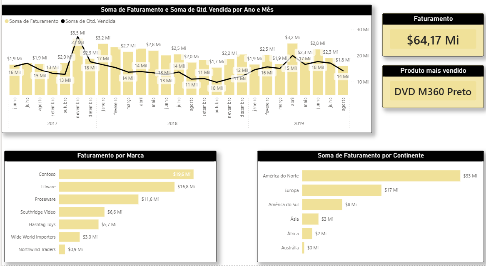

# Dashboard_vendas_powerbi
Nesse desafio foi desenvolvido um dashboard de vendas.
Respondemos perguntas como:

📊 Soma de faturamento e soma de quantidade vendida por ano e mês
📊 Total de faturamento
📊 Produto mais vendido
📊 Soma de faturamento por continente
📊 Faturamento por marca

importamos dados do excel para o power bi
tratamento de dados no power query
layout criado no figma e importamos para o power bi

